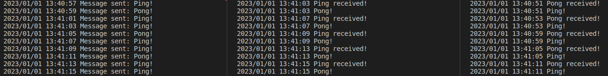

## Simple RabbitMQ program created for learning purposes.
Run with Makefile commands.  
Producer produces random, direct Ping-Pong messages send through exchange for specific consumers with queues binded to Ping or Pong signals.  
Could easily be modified to use topics and/or bind multiple queues.  
For meaningful replies RPC variant could be used.  

